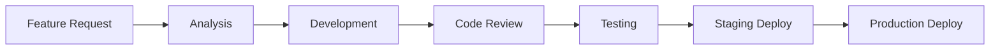

# Indicaai Marketplace

<div align="center">
  
  <br/>
  <h3>🎯 Conectando necessidades às melhores soluções</h3>
  <p><em>Plataforma marketplace inteligente para negócios B2B e B2C</em></p>
</div>

---

## 📋 Visão Geral

O **Indicaai Marketplace** é uma plataforma digital avançada que revoluciona a conexão entre demandas e ofertas de produtos e serviços. Desenvolvido com tecnologias modernas, oferece um ecossistema completo para anunciantes, fornecedores e prestadores de serviços.

## 🎯 Missão & Visão

**Missão:** Democratizar o acesso a soluções de qualidade através de tecnologia inovadora que conecta necessidades específicas com os melhores fornecedores do mercado.

**Visão:** Ser a principal plataforma marketplace do Brasil, reconhecida pela confiabilidade, tecnologia de ponta e excelência na experiência do usuário.

## ✨ Funcionalidades Principais

### 🏠 **Dashboard Inteligente**
- Interface moderna e responsiva
- Métricas personalizadas em tempo real
- Central de notificações unificada
- Atalhos para ações frequentes

### 🎯 **Sistema de Anúncios Avançado**
- **Publicação Inteligente:** Criação guiada com IA para otimização
- **Gestão Completa:** Status, edição, renovação automática
- **Upload Múltiplo:** Suporte a imagens, documentos e vídeos
- **Geolocalização:** Localização automática com raio de alcance
- **Categorização:** Sistema hierárquico com subcategorias
- **Durabilidade:** Controle automático de expiração

### 💰 **Orçamentos & Negociação**
- **Recebimento Inteligente:** Propostas categorizadas e filtradas
- **Geração de PDFs:** Orçamentos profissionais automatizados
- **Status Tracking:** Acompanhamento completo do pipeline
- **Histórico Detalhado:** Análise de performance e trends
- **Negociação Integrada:** Chat contextual para discussões
- **Aprovação Rápida:** Workflow otimizado para fechamento

### 💬 **Comunicação Unificada**
- **Chat em Tempo Real:** WebSocket para mensagens instantâneas
- **Contexto Inteligente:** Histórico vinculado a anúncios/orçamentos
- **Notificações Push:** Alertas personalizáveis por categoria
- **Anexos Seguros:** Compartilhamento de arquivos criptografados
- **Status de Leitura:** Controle de visualização de mensagens

### ⭐ **Sistema de Reputação**
- **Avaliação 360°:** Clientes e fornecedores se avaliam mutuamente
- **Métricas Avançadas:** Pontualidade, qualidade, comunicação
- **Ranking Dinâmico:** Algoritmo que considera histórico e recência
- **Badges de Qualidade:** Certificações automáticas por performance
- **Proteção Anti-Fraude:** Validação de avaliações genuínas

### 🔍 **Busca & Descoberta**
- **Interface Moderna:** Design premium responsivo (Fase 1 implementada)
- **Filtros Avançados:** Localização, categoria, preço, avaliação
- **Geolocalização:** Busca por proximidade com slider de raio
- **Chips Interativos:** Filtros ativos removíveis individualmente
- **Autocompletar:** Sugestões inteligentes baseadas em histórico
- **Resultados Personalizados:** ML para relevância individual

### 👥 **Gestão de Usuários Premium**
- **Perfis Verificados:** Sistema de validação em camadas
- **Onboarding Suave:** Middleware inteligente para completar perfil
- **Tipos de Usuário:** Anunciante, Fornecedor ou Ambos
- **Central de Ajuda:** Sistema integrado de suporte
- **Geolocalização:** Atualização automática de localização
- **Histórico Completo:** Timeline de todas as atividades

### 📱 **API REST Completa**
- **Documentação Swagger:** Interface interativa para desenvolvedores
- **Autenticação Segura:** JWT + refresh tokens
- **Rate Limiting:** Controle de requisições por usuário
- **Webhooks:** Notificações para integrações externas
- **SDKs Oficiais:** Libraries para principais linguagens
- **Versionamento:** Controle de compatibilidade de API

## 🛠️ Arquitetura Tecnológica

### **Backend (Core)**
```python
# Stack Principal
Python 3.12+              # Linguagem base
Django 5.0+               # Framework web
Django REST Framework     # API REST
PostgreSQL 15+            # Banco principal
Redis 7+                  # Cache & Sessions
Celery + RabbitMQ        # Processamento assíncrono
```

### **Frontend (UI/UX)**
```javascript
// Stack de Interface
HTML5 Semântico          # Estrutura acessível
CSS3 + Flexbox/Grid      # Layout moderno
JavaScript ES2023        # Interatividade
Bootstrap 5.3+           # Design system
AJAX + Fetch API         # Requisições assíncronas
Progressive Enhancement   # Funcionalidade em camadas
```

### **DevOps & Infraestrutura**
```yaml
# Ambiente de Produção
Docker + Docker Compose   # Containerização
Nginx                    # Proxy reverso & Load balancer
Let's Encrypt            # SSL/TLS automático
AWS S3                   # Storage de mídia
Sentry                   # Monitoramento de erros
ELK Stack               # Logging centralizado
```

### **Ferramentas de Desenvolvimento**
```bash
# Workflow de Desenvolvimento
Git + GitFlow           # Controle de versão
Pre-commit hooks        # Qualidade de código
Pytest                  # Testes automatizados
Coverage.py             # Cobertura de testes
Black + Flake8         # Formatação e linting
```

## 📦 Estrutura de Projeto

```
indicaai-marketplace/
├── 📁 apps/
│   ├── ads/                  # 🎯 Sistema de anúncios
│   │   ├── models.py         # Necessidades, categorias
│   │   ├── views.py          # CRUD + lógica de negócio
│   │   ├── forms.py          # Validação de formulários
│   │   ├── signals.py        # Eventos automáticos
│   │   └── metrics.py        # Analytics de anúncios
│   ├── budgets/              # 💰 Orçamentos
│   │   ├── models.py         # Propostas, negociações
│   │   ├── email_signals.py  # Notificações automáticas
│   │   └── templatetags/     # Tags customizadas
│   ├── chat/                 # 💬 Mensagens
│   │   ├── models.py         # Conversas, mensagens
│   │   ├── utils.py          # Utilitários de chat
│   │   └── templatetags/     # Helpers de template
│   ├── search/               # 🔍 Busca avançada
│   │   ├── views.py          # Interface modernizada
│   │   ├── context_processors.py # Estados e filtros
│   │   └── management/       # Comandos de dados
│   ├── users/                # 👥 Gestão de usuários
│   │   ├── models.py         # Perfis estendidos
│   │   ├── forms.py          # Registro e atualização
│   │   └── utils.py          # Geolocalização
│   ├── notifications/        # 🔔 Sistema de alertas
│   ├── rankings/            # ⭐ Avaliações
│   └── categories/          # 📋 Categorização
├── 📁 core/
│   ├── settings/            # Configurações por ambiente
│   ├── middleware.py        # Middleware de perfil suave
│   ├── decorators.py        # Decoradores customizados
│   └── context_processors.py # Contexto global
├── 📁 api/                  # 🔌 API REST
│   ├── serializers.py       # Serialização de dados
│   ├── permissions.py       # Controle de acesso
│   ├── swagger.py          # Documentação
│   └── tests.py            # Testes de API
├── 📁 static/              # 🎨 Assets frontend
├── 📁 templates/           # 📄 Templates HTML
├── 📁 media/               # 📂 Uploads de usuários
└── 📁 nginx/               # 🌐 Configuração web server
```

## ⚙️ Guia de Instalação

### **Ambiente de Desenvolvimento**

#### **Pré-requisitos**
- Python 3.12+
- PostgreSQL 15+
- Redis 7+
- Node.js 18+ (para assets)
- Git

#### **Configuração Rápida**

```bash
# 1. Clone e acesse o projeto
git clone [repository-url] indicaai-marketplace
cd indicaai-marketplace

# 2. Crie ambiente virtual
python -m venv venv
source venv/bin/activate  # Linux/MacOS
# ou
venv\Scripts\activate     # Windows

# 3. Instale dependências
pip install -r requirements.txt

# 4. Configure ambiente
cp core/settings/.env.example .env
# Edite o .env com suas configurações

# 5. Configure banco de dados
createdb indicaai_db
python manage.py migrate

# 6. Dados iniciais
python manage.py createsuperuser
python manage.py import_categories data/categories.csv
python manage.py populate_states

# 7. Execute o servidor
python manage.py runserver 127.0.0.1:8081
```

### **Deploy com Docker**

```bash
# Deploy completo
docker-compose up -d

# Apenas aplicação
docker build -t indicaai-marketplace .
docker run -p 8000:8000 indicaai-marketplace
```

### **Variáveis de Ambiente**

```bash
# .env - Configurações principais
DJANGO_SECRET_KEY=your-secret-key
DJANGO_DEBUG=False
DJANGO_ALLOWED_HOSTS=necessito.online,www.necessito.online

# Database
DB_NAME=indicaai_production
DB_USER=indicaai_user
DB_PASSWORD=secure_password
DB_HOST=localhost
DB_PORT=5432

# Email (SMTP)
EMAIL_HOST=smtp.gmail.com
EMAIL_PORT=587
EMAIL_USE_TLS=True
EMAIL_HOST_USER=noreply@necessito.online
EMAIL_HOST_PASSWORD=app_password

# reCAPTCHA
RECAPTCHA_PUBLIC_KEY=your_public_key
RECAPTCHA_PRIVATE_KEY=your_private_key

# AWS S3 (Opcional)
AWS_ACCESS_KEY_ID=your_access_key
AWS_SECRET_ACCESS_KEY=your_secret_key
AWS_STORAGE_BUCKET_NAME=indicaai-media
```

## 🔧 Comandos de Gestão

### **Dados e Migrações**
```bash
# Importar dados iniciais
python manage.py import_categories data/categories.csv
python manage.py populate_states

# Atualizar geolocalizações
python manage.py atualizar_geolocalizacao_usuarios
python manage.py geolocalizar_usuarios

# Limpeza e manutenção
python manage.py collectstatic --noinput
python manage.py compress  # Se usando django-compressor
```

### **Backup e Restore**
```bash
# Backup automático
./backup_config.sh

# Backup manual
pg_dump indicaai_db > backup_$(date +%Y%m%d_%H%M%S).sql

# Restore
psql indicaai_db < backup_file.sql
```

## 📊 URLs e Endpoints

### **Frontend Principal**
- **Home:** `/`
- **Busca:** `/buscar/`
- **Dashboard:** `/dashboard/`
- **Perfil:** `/users/minha-conta/`
- **Central de Ajuda:** `/ajuda/`

### **API REST**
- **Documentação:** `/api/docs/`
- **Swagger UI:** `/api/swagger/`
- **Anúncios:** `/api/v1/necessidades/`
- **Orçamentos:** `/api/v1/orcamentos/`
- **Usuários:** `/api/v1/users/`

### **Admin & Gestão**
- **Admin Django:** `/admin/`
- **Status Sistema:** `/api/health/`
- **Métricas:** `/api/metrics/`

## 🔒 Segurança & Compliance

### **Proteção de Dados**
- ✅ **LGPD Compliant** - Conformidade total com Lei Geral de Proteção de Dados
- ✅ **Criptografia** - Dados sensíveis criptografados em repouso e trânsito
- ✅ **Anonimização** - Dados pessoais anonimizados em analytics
- ✅ **Retenção** - Políticas claras de retenção de dados

### **Segurança Técnica**
- ✅ **HTTPS Obrigatório** - Redirecionamento automático
- ✅ **HSTS Headers** - Proteção contra downgrade attacks
- ✅ **CSP** - Content Security Policy implementado
- ✅ **Rate Limiting** - Proteção contra ataques de força bruta
- ✅ **SQL Injection** - Proteção via ORM Django
- ✅ **XSS Protection** - Sanitização automática de inputs

### **Autenticação & Autorização**
- ✅ **Senhas Seguras** - Hash bcrypt + salt
- ✅ **Sessões Seguras** - Tokens seguros com expiração
- ✅ **Permissões Granulares** - Controle fino de acesso
- ✅ **2FA Disponível** - Autenticação dois fatores opcional

## 📈 Monitoramento & Analytics

### **Métricas de Negócio**
- Dashboard executivo em tempo real
- KPIs de conversão e engajamento
- Análise de funil de vendas
- Relatórios automatizados de performance

### **Monitoring Técnico**
```python
# Ferramentas implementadas
Sentry                    # Error tracking e performance
Django Debug Toolbar      # Debug em desenvolvimento  
Django Extensions        # Comandos administrativos extras
PostgreSQL Slow Query Log # Otimização de queries
Redis Monitor            # Performance de cache
```

### **Logs Estruturados**
```json
{
  "timestamp": "2024-01-15T10:30:00Z",
  "level": "INFO",
  "user_id": 12345,
  "action": "budget_created",
  "resource_id": 67890,
  "ip_address": "192.168.1.100",
  "user_agent": "Mozilla/5.0...",
  "execution_time": "0.245s"
}
```

## 🚀 Roadmap & Funcionalidades Futuras

### **Q1 2024**
- [ ] **App Mobile** - React Native para iOS/Android
- [ ] **IA Avançada** - Recomendações personalizadas com ML
- [ ] **Pagamentos** - Gateway integrado PagSeguro/Stripe
- [ ] **Gamificação** - Sistema de pontos e badges

### **Q2 2024**
- [ ] **Multi-idiomas** - Internacionalização completa
- [ ] **API GraphQL** - Alternativa ao REST para mobile
- [ ] **Marketplace B2B** - Funcionalidades empresariais
- [ ] **Integração ERP** - Conectores para sistemas empresariais

### **Q3 2024**
- [ ] **Blockchain** - Contratos inteligentes para transações
- [ ] **IoT Integration** - Conectividade com dispositivos
- [ ] **AR/VR** - Visualização de produtos em realidade aumentada
- [ ] **Analytics Avançado** - BI e relatórios customizáveis

## 🤝 Equipe & Contribuição

### **Core Team**
- **Product Owner:** Definição de roadmap e features
- **Tech Lead:** Arquitetura e decisões técnicas  
- **Full Stack Developers:** Desenvolvimento e manutenção
- **DevOps Engineer:** Infraestrutura e deploy
- **QA Engineer:** Testes e qualidade

### **Processo de Desenvolvimento**


### **Standards de Código**
- **PEP 8** - Style guide para Python
- **Conventional Commits** - Padrão de mensagens git
- **Code Review** - Obrigatório para todas as mudanças
- **Test Coverage** - Mínimo 80% de cobertura
- **Documentation** - Docstrings obrigatórias

## 📞 Suporte & Contato

### **Ambientes**
- **Produção:** https://necessito.online
- **Staging:** https://staging.necessito.online
- **API Docs:** https://necessito.online/api/docs/

### **Suporte Técnico**
- **Email:** dev@necessito.online
- **Slack:** #indicaai-tech
- **Status Page:** https://status.necessito.online

---

<div align="center">
  <p><strong>Indicaai Marketplace</strong> - Conectando o futuro dos negócios</p>
  <p><em>Desenvolvido com ❤️ pela equipe Indicaai</em></p>
  <p>
    
    
    
    
  </p>
</div>
